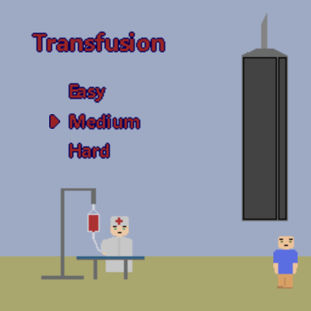
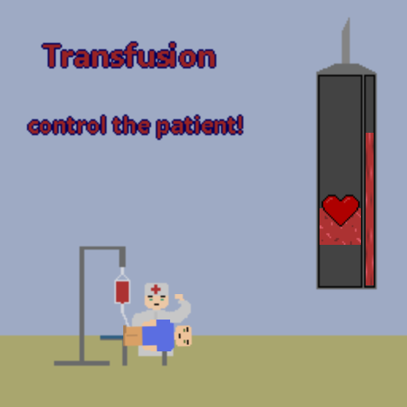
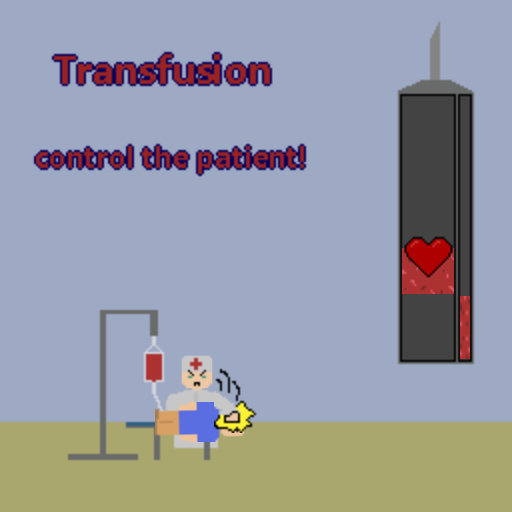
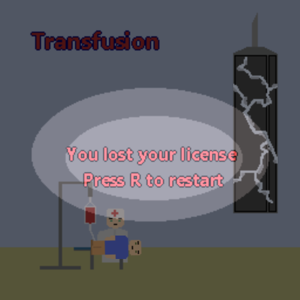
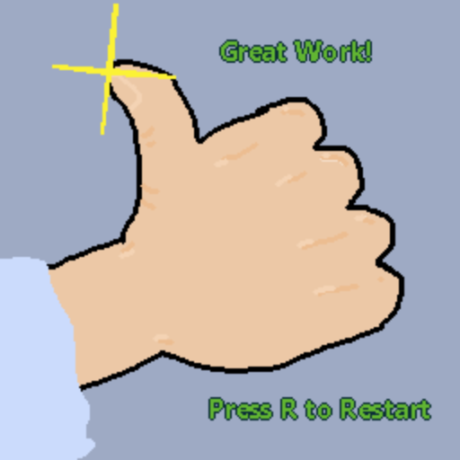

# MiniJams

#### How MiniJam works

Each minijam is a 72hr long hackathon competition to make a game within the time limit that follows the theme and makes use of the hidden limitation that is revealed at the start!

## Fusion - MiniJam #133

###### May 26th to May 28th

###### Theme - Fusion

###### Limitation - Control the environment

[Youtube Demo](https://www.youtube.com/watch?v=etDpRFE9OSc)

#### Description of gameplay

Play as a nurse who needs to keep the patients heart rate in the hotzone **at all costs** to have a successful blood transfusion!

To increase the heart rate, give them a good ol whack by hitting the spacebar! Try to keep the heart inside the hotzone and fill up the side meter!

_Slap your way to sweet sweet victory!_

Includes easy, medium, and hard difficulties.

#### Tools used

MonoGame and Aseprite

#### Placement

###### 109th out of 138

#### Improvements

I used a framework with no webGL support, meaning people can't play the game in browser. The lack of easability is a huge factor in it's placement as only 4 people reviewed it and gave a rating.

I used this gamejam as an opportunity to try out something new, MonoGame, a C# framework to create games because I saw a favorite of mine, Celeste was made with it. I much prefer an engine, especially on a time crunch!

I would love to have added more polish to my submission by making better sprites, using more sound effects, and creating a how to play menu.

#### How to play the game

Use the arrow keys to select a difficulty, pressing space to select. Then hold spacebar to increase the position of the heart, and let go of spacebar to let it glide back down. Try to fill the meter by keeping the heart in the hotzone!

#### Screenshots

 
 

